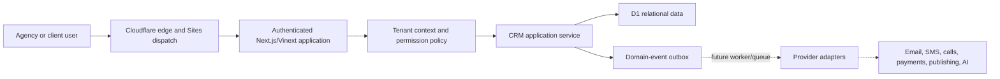

# BrizBuilder Architecture

## Decision summary

BrizBuilder begins as a modular monolith deployed to a Cloudflare Worker. The UI, authenticated route handlers, CRM application service, and D1 persistence live in one deployable unit, but module boundaries and provider adapters are explicit. This keeps Phase 1 operable by a small team without locking later communications, automation, and publishing workloads into synchronous HTTP requests.

## Architecture decisions

### ADR-001: Modular monolith first

**Decision:** Use a single deployable application with domain-oriented services and tables.

**Reason:** Phase 1 transactions require strong tenant consistency and do not justify distributed operations. Future workload isolation can be introduced behind event and adapter boundaries.

**Exit signal:** Split a module only when independent scaling, reliability, compliance, deployment cadence, or ownership provides measurable value.

### ADR-002: D1 is the Phase 1 system of record

**Decision:** Store tenant, CRM, customization, flags, audit, and outbox data in Cloudflare D1 through Drizzle schema and generated migrations.

**Reason:** The data is relational and fits an edge-deployed Phase 1. Foreign keys and composite indexes make tenant scoping inspectable.

**Evolution:** Provider payloads and files move to R2; ephemeral locks/rate limits move to KV or Durable Objects; heavy job delivery uses Queues. A PostgreSQL migration is reserved for workloads that require higher write concurrency, advanced full-text search, or complex analytics.

### ADR-003: Tenant scope is server-derived

**Decision:** Build request context from the authenticated identity and persisted membership. Repositories receive that context and always filter by organization; client users receive an additional client constraint.

**Reason:** Browser-provided tenant identifiers are untrusted. UI filtering is a usability feature, never a security boundary.

### ADR-004: Explicit role permissions

**Decision:** Map each role to named capabilities such as `contacts.write`, `contacts.import`, `companies.write`, `custom_data.manage`, and `audit.read`. Mutations call `requirePermission` before touching data.

**Reason:** Capability names survive role changes and provide a future path to custom roles.

### ADR-005: Transactional outbox boundary

**Decision:** Critical mutations append a durable `domain_events` record alongside audit data. The event contains a stable type, tenant scope, actor, JSON payload, and processing state.

**Reason:** Future automations and provider delivery must not make core CRM writes depend on third-party availability. A queue dispatcher can later claim and deliver events idempotently.

### ADR-006: Persisted feature flags

**Decision:** Flags are tenant-scoped data. Phase 1 flags enable functional CRM modules; future module flags remain disabled and create no navigation entry.

**Reason:** Product rollout must be deliberate, observable, and reversible. A visible placeholder is not a feature flag.

### ADR-007: Provider adapters

**Decision:** External providers implement internal contracts for messaging, telephony, payments, domains, analytics, storage, and AI. Domain records hold internal IDs plus external references; raw provider payloads are not the business model.

**Reason:** Provider replacement, replay, sandboxing, and testing remain possible.

## Current module boundaries

- `app/`: responsive product shell, views, forms, and authenticated API handlers.
- `db/schema.ts`: canonical relational schema.
- `db/crm.ts`: tenant context, authorization, Phase 1 queries/actions, audit, seeding, and template rendering.
- `drizzle/`: ordered generated database migrations.
- `tests/`: Worker-level D1 and tenant-isolation integration coverage.
- `.openai/hosting.json`: Cloudflare/Sites runtime and D1 binding configuration.

## Data rules

- IDs are opaque and stable; email addresses and names are never tenant keys.
- Organization-owned tables carry `organization_id`.
- Client data additionally carries `client_id`.
- Relationship tables validate both sides under the same tenant scope.
- Custom field definitions are scoped and typed; values are JSON with server validation.
- Reusable custom values use an allowlisted token renderer. Arbitrary evaluation is prohibited.
- Audit logs are append-only through application workflows.
- Baseline initialization uses stable, idempotent inserts for the organization, admin membership, feature flags, and pipeline stages only.

## Future infrastructure seams

1. A dispatcher reads unprocessed outbox events and publishes them to Cloudflare Queues.
2. Module workers handle idempotent jobs with retry/backoff/dead-letter policies.
3. Provider webhook adapters verify signatures, store receipt IDs, and emit normalized events.
4. R2 stores media, exports, call recordings, website assets, and large payload archives.
5. A search projection supports global and conversation search without bypassing tenant filters.
6. An analytics projection separates operational queries from long-running reporting workloads.

These are architecture-ready seams, not claims that the corresponding product modules exist today.
