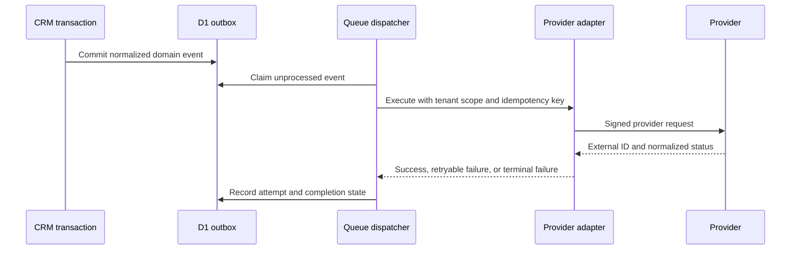

# BrizBuilder Integration Strategy

## Current state

Phase 1 has no live third-party delivery integration. D1 is the only runtime data dependency, and Sites dispatch supplies hosted authentication. Future integration flags are persisted but disabled. This prevents a provider logo, button, or navigation item from implying a capability that cannot complete its primary workflow.

## Adapter contract

Each provider adapter must expose a narrow internal contract and return normalized results:

- `connect`: create or validate a tenant-scoped connection;
- `disconnect`: revoke local and provider credentials;
- `health`: report credential, quota, and configuration state;
- `execute`: perform a bounded, idempotent provider action;
- `receiveWebhook`: authenticate, deduplicate, normalize, and enqueue an inbound event;
- `reconcile`: compare local and provider state after partial failure;
- `redact`: produce safe diagnostic data without secrets or customer content.

Every call carries organization/client scope, an idempotency key, correlation ID, actor or automation identity, and a timeout. Adapters must not query unrelated tenant data.

## Delivery lifecycle

The current application implements the outbox write boundary. Queue dispatch, claims, retry metadata, and provider adapters are future-phase work.

## Planned providers and gates

| Capability | Candidate providers | Earliest phase | Required launch gate |
|---|---|---:|---|
| Transactional/bulk email | Resend, SendGrid, Mailgun, customer SMTP | 2 | Domain verification, unsubscribe/suppression, bounce/complaint webhooks, sending limits |
| SMS/MMS | Twilio or Telnyx | 2 | A2P registration, consent/evidence, opt-out keywords, quiet hours, delivery receipts |
| Voice/call tracking | Twilio or Telnyx | 2 | Number provisioning, recording-consent policy, call events, storage/retention controls |
| Calendar sync | Google Calendar, Microsoft Graph | 2 | OAuth state/PKCE, encrypted tokens, conflict handling, revocation and reconciliation |
| Forms and webhooks | Signed BrizBuilder endpoints | 4 | Rate limits, bot controls, signature/replay protection, schema versioning |
| Website/funnel domains | Cloudflare DNS and Workers | 5 | Ownership verification, certificate state, rollback, tenant routing and abuse controls |
| Media storage/optimization | Cloudflare R2 and image transforms | 5 | MIME validation, malware policy, signed access, quotas, deletion and cache invalidation |
| Payments | Stripe Connect/Billing | 6 | Hosted collection, webhook idempotency, ledger reconciliation, refund/dispute handling |
| Reputation | Google Business Profile and supported networks | 7 | OAuth verification, platform policy review, review-link attribution and consent |
| Social publishing | Meta, LinkedIn, Google Business Profile | 7 | Platform app approval, token rotation, scheduling/retry, media validation |
| AI generation/agents | OpenAI API | 9 | Tenant budget, content policy, tool allowlists, human approval, disclosure and audit |
| Agency SaaS billing | Stripe Billing | 10 | Entitlement source of truth, proration, grace periods, dunning and webhook recovery |
| Public developer platform | OAuth 2.1 and scoped API keys | 11 | Scope review, hashing, rotation, quotas, abuse detection, audit and revocation |

Provider selection remains a product and operational decision. The domain model must not assume one provider's payload format.

## Connection storage

Future `integration_connections` records should contain tenant scope, adapter/provider name, status, external account identifier, encrypted credential reference, granted scopes, configuration JSON, health timestamp, and audit timestamps. Secrets should be stored through the deployment secret/encryption facility, not as plain D1 values.

Inbound deliveries require a receipt record keyed by provider and provider event ID. A valid duplicate returns success without reapplying the event. Unknown tenants, invalid signatures, stale timestamps, and unsupported schema versions are rejected before normalization.

## Observability and support

All provider work needs structured logs with tenant-safe correlation IDs, latency, attempt count, normalized error code, cost/usage where available, and redacted provider response. Dashboards must distinguish credential errors, customer configuration errors, provider outages, throttling, and code defects. Support tools may retry or reconcile work but must not reveal secrets or bypass tenant policy.

